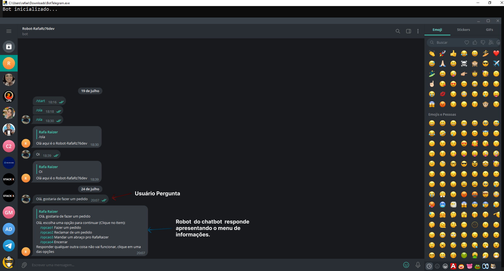

***
<div align="center">

[](https://git.io/typing-svg)


<a href="https://git.io/typing-svg" align="center"></a>  

***
##   Venho aqui apresentar   

  
# **_2º PROJETO CHATBOT_**

### O projeto consiste em uma aplicação onde o usuário vai interagir através de perguntas realizadas pelo _boot_, utilizando a principal stack Python, as bibliotecas os, pip3 e pyinstaller e como deploy instanciando o AWS/EC2 para criar um projeto incrível e de alta performance.
###  
## [Clique aqui para inicializar o ChatBot](https://github.com/RafaRz76Dev/cha/raw/master/dist/chat.exe)

## [Clique aqui para acessar o Telegram](https://t.me/rafarz76dev_bot)


<br>

 [Demonstração do ChatBot/Telegram]   



<div align="left">

<br>

***

##   Tecnologias utilizadas no projeto

- [Python](https://www.python.org/)(v3.10.4)
- [pyTelegramBotAPI](https://pypi.org/project/pyTelegramBotAPI/)(v4.12.0)
- [pip3](https://pip.pypa.io/en/stable/getting-started/)(v23.2)
- [pyinstaller](https://pyinstaller.org/en/stable/) 
- [AWS/EC2 ](https://sa-east-1.console.aws.amazon.com/ec2/home?region=sa-east-1#Instances:v=3;$case=tags:true%5C,client:false;$regex=tags:false%5C,client:false)

<br>

***

##    Ferramenta utilizada no projeto

- [VsCode](https://code.visualstudio.com/download) (v1.80.1)

***
##   Instruções de execução

Para rodar o projeto no ambiente local do VsCode siga os seguintes passos:

1. Criação do bot no telegram:	
- Dentro do telegram você vai digitar “BothFather, então clica em iniciar e após clica 👇
/Newbot  (para criar o nome do bot).

- Nome do bot👇
```
Robot-RafaRz76dev
```

- Nome do usuário👇
```
rafarz76dev_bot
```

2. Abra o terminal e navegue até o diretório raiz do projeto.
   
2. Instale as bibliotecas do ChatBot executando o comando a seguir:

 (Ativar o chatbot no Telegram)
```bash 
   pip install pytelegrambotapi
```

 (Deplopy da instancia AWS/EC2)
```bash 
   pip3 install pyinstaller
```

- E logo após
 (Baixar o arquivo .exe e funcionar o deploy AWS/EC2)
```bash 
  pyinstaller --onefile BotTelegram.py 
```

3. Após a instalação das bibliotecas, inicie clicando:

```
 Run Code
```

***

##   Agora você está pronto para interagir com o projeto:
   -  Pelo terminal de comando do VSCode;
   -  Clicando em ```Inciar ChatBot``` e após acessar pelo ```Telegram```. 
   -   ou na _pasta dist_   _no arquivo "BotTelegram.exe"_  vai baixar o download em ```View raw```   
   - E após vai abrir na pasta do seu computador em `download` no arquivo _BotTelegram.exe.

<br>

   - ##  Autor

<p>
    
    <p>&nbsp&nbsp&nbspRafaRz76Dev<br>
    &nbsp&nbsp&nbsp<a href="https://api.whatsapp.com/send/?phone=47999327137">Whatsapp</a>&nbsp;|&nbsp;<a href="https://www.linkedin.com/in/rafael-raizer//">LinkedIn</a>&nbsp;|&nbsp;<a href="https://github.com/RafaRz76Dev">GitHub</a>|&nbsp;<a href="https://public.tableau.com/app/profile/rafael.raizer">Tableau</a>|&nbsp;<a href="https://portifolio-rafarz76dev.netlify.app/">Portfólio</a>&nbsp;</p>
</p>
